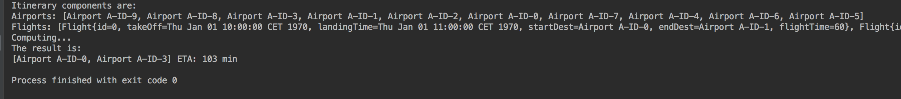
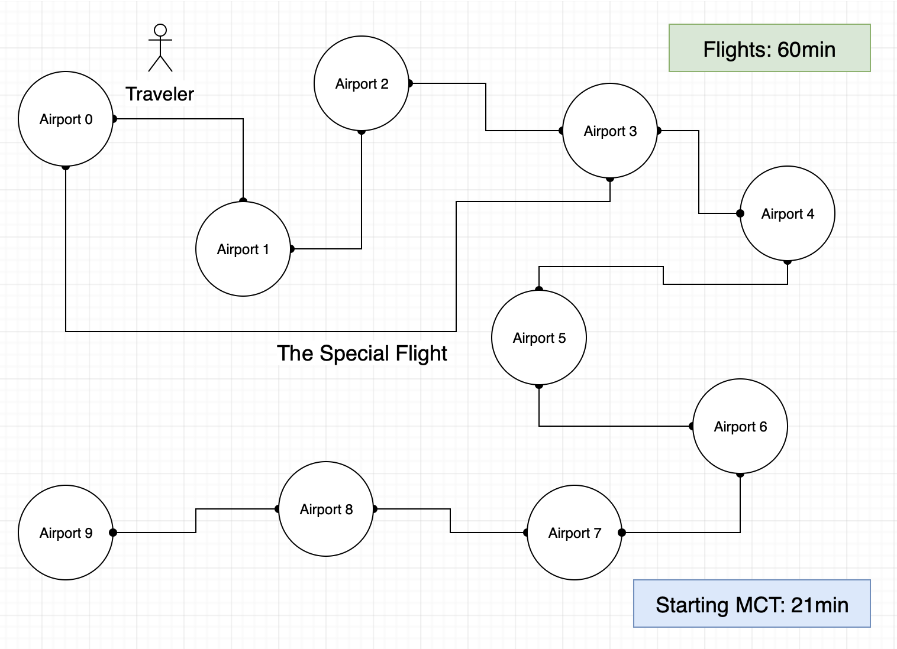

# Flights Management
<h3>A second year university project.</h3>

<i>~ A newer version of this algorithmic task will be done.</i> 🛩

* Made for the <b>CS103 Algorithms & Data Structures</b> course.
* Has an implementation of Dijkstra's algorithm for finding the shortest flight path and minimum time spent traveling (but not waiting while connecting flights).
* Meaning in reference to the previous bullet point: No A* algorithm upgrade (no real node heuristics).
* Usage of various data structures.
* A graph theory problem solved in an airports + flights setting.
* No kind of GUI was created for this project.
#### Project result example:
<h6>Result Example &#x2198;</h6>

<h6>Dumb Example Graph &#x2198;</h6>

