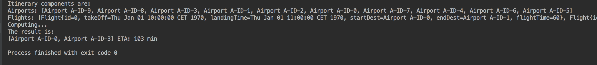

# flights-management
<h3>A second year university project:</h3>
<ul style="list-style-type:circle">
  <li>Made for the <i>CS103 Algorithms & Data Structures</i> course</li>
  <li>Second of three projects made for that course</li>
  <li>Usage of various data structures</li>
  <li>Has a custom algorithm that finds the quickest path in terms of flying</li>
  <li>No kind of GUI was created for this project</li>
</ul>
<h3>Project result example:</h3>

Result Example

